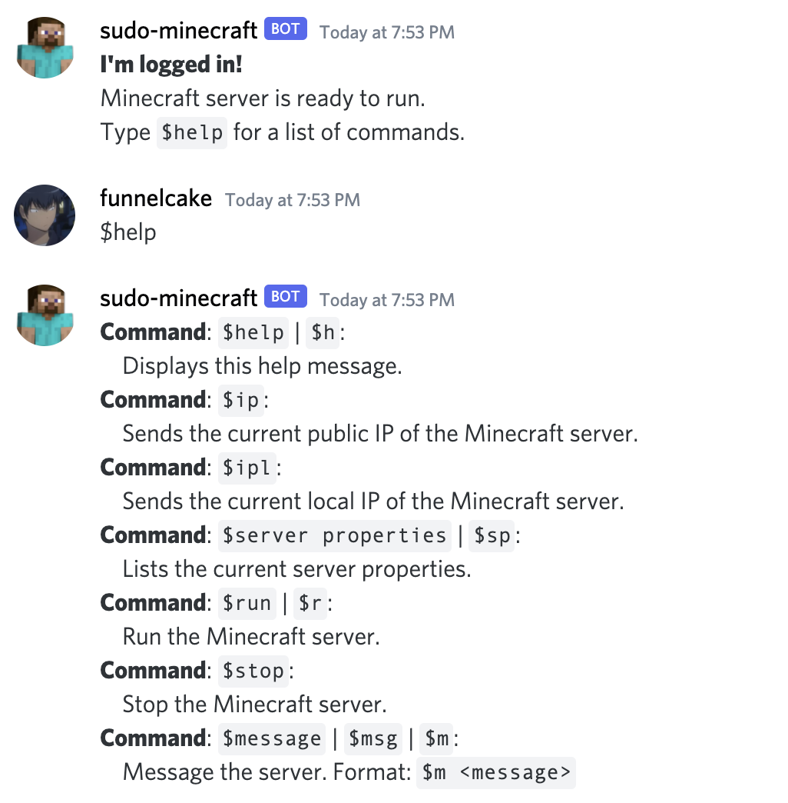

# `discord-sudo-minecraft`

`sudo-minecraft` is a Discord bot that allows for full control of a Minecraft server via Discord. This bot allows for a user to start, stop, message, and change the server's settings. This bot was primarily written in Python3 with heavy use of the `discord.py` API and the `asyncio` asynchronous I/O library.

This bot was tested with Python 3.9.5.

## Using the Bot
When the bot logs into a Discord server, it greets the server in the default channel set in the `.env` file. Typing `$help` in the channel will provide all the options currently supported by the bot.

## Setup
First let's set up some of our environment variables.

 * Copy the `.envTEMPLATE` file to `.env`.
 * Change the value of `SERVER-DIRECTORY` to the directory containing your `server.jar` server file.
 * Change the value of `COMMUNICATION-CHANNEL` to the default channel you'd like the bot to send messages in.
 * We'll change the token value in the next section.

Next, we need to register a bot on Discord.

* Go to [https://discord.com/developers/applications](https://discord.com/developers/applications).
* Click **New Application**.
* Enter a name, e.g. _sudo-minecraft_, and click **Create**.
* Go to the **Bot** tab, click **Add Bot**, and confirm.
* Copy the token by clicking **Copy** and change the value of `TOKEN-SUDO-MINECRAFT` to this token.

We now need to invite the bot to your Discord server.

* Go to the OAuth2 tab and check **bot**.
* Choose permissions needed for the bot. I selected all permissions under _Text Permissions_ and selected _view channels_ under _General Permissions_.
* Copy the URL above the permissions and go to the site in your browser of choice. Choose the correct server to invite the bot to and click _Authorize_.

Now let's set up the client.

 * Set up a virtual environment in this folder like so: `python3 -m venv venv`. This will create a folder `venv` that will contain our dependencies.
 * Activate the virtual environment like so: `source venv/bin/activate`.
 * Install dependencies like so: `pip install -r requirements.txt`.
 * NOTE: the `MinecraftServerAdmin` class (in `minecraft_server.py`) assumes your server runs from a java executable called `server.jar`. You can change the name that is used and other parameters by editing the `run_cmd_default` class variable.

Now, running the bot should be as simple as running `python main.py`.